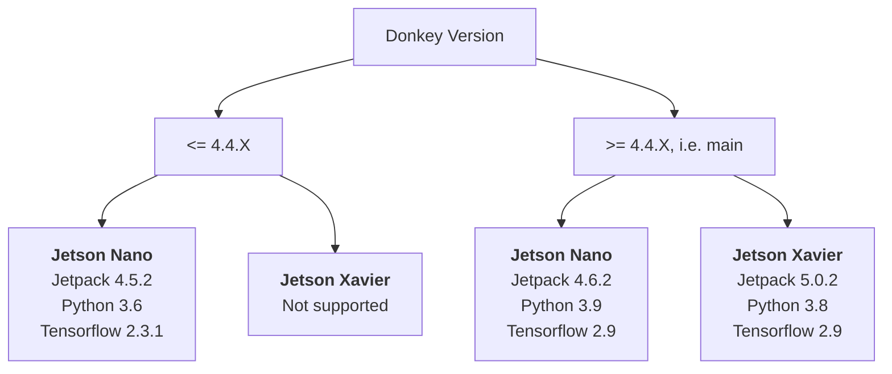

#DocGarbanzo Car

## Donkey Car

Donkey&reg; Car is an open-source project for building self-driving RC cars. 
It is highly hackable and a platform for experimentation. Donkey cars are:

* Fast
* Cheap
* Out of control

The Donkey Car code and documentation is available here:

* [GitHub](https://github.com/autorope/donkeycar)
* [Documentation](https://docs.donkeycar.com)

## Car Build

[Here](buggy.md) is a build log of the bespoke Donkey Car that I built on an 
alternative RC car platform. 

